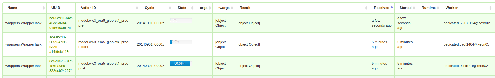

Hindcast Scheduler
===================

----

.. code::

    usage: scheduler cycle [-h] [-a ACTIONS] [-w WORKFLOWS] [-t] [-i] [-d] [-u]
                           [-f FREQUENCY] [-k INTERVAL] [-r ROUTING_KEY]
                           cycle_dt [end_cycle_dt]

    positional arguments:
      cycle_dt              Cycle datetime in the pattern %Y%m%d_%H%Mz
      end_cycle_dt          Cycle datetime in the pattern %Y%m%d_%H%Mz

    optional arguments:
      -h, --help            show this help message and exit
      -a ACTIONS, --actions ACTIONS
                            List (separated by ,) of actions ids to be submitted
                            by this cycle task. Default: All actions in active
                            workflows for this cycle
      -w WORKFLOWS, --workflows WORKFLOWS
                            List (separated by ,) of wokflows ids to be submitted
                            by this cycle task. Default: All active workflows for
                            this cycle
      -t, --test            Don't submit the cycle, only list the selected actions
      -i, --ignore_missing  Cycle should ignore missing dependencies not declared
                            in workflow
      -d, --downstream      Include dependencies downstream from the selected
                            actions recursively
      -u, --upstream        Include dependencies upstream from the the selected
                            actions (also include downstream)
      -f FREQUENCY, --frequency FREQUENCY
                            Force actions to use this Cycles frequency
      -k INTERVAL, --interval INTERVAL
                            Force actions to use this Cycles interval*frequency.
                            Default: 1
      -r ROUTING_KEY, --routing_key ROUTING_KEY
                            Force all the actions for the cycles to be executed
                            with the defined routing_key

----

New Features
=======================

- User defined cycle periods (day, week, month, year, etc.)
- Multiple workflows
- Tasks can now depend on tasks from past cycles

----

Use cases
=========================

- workflows
      - SWAN nested configurations
      - Monthly workflows (e.g. hindcast suite off a CFSR download)

- Intercycle dependencies
      - Nests model runs
      - Separated pre/model/post
          -  e.g.  WW3 
             -  preprocessing 15 mins
             -  model 1 hour
             -  postprocessing 45 mins

----

Wrapper Changes
=========================

.. code-block:: python

    class WW3HC(WW3):
        runtype='hindcast'

        def __init__(self, *args, **kwargs):
            assert 'schedule' in kwargs and 'cycles' in kwargs['schedule'], (
                'action must contain <schecule> dict with <cycles> key')

            kwargs.update({'dlen': 0})
            kwargs.update({'hclen': 0})
            kwargs.update({'cyclelock': False})
            kwargs.update({'hashdir': False})
            super(WW3HC,self).__init__(*args, **kwargs)
            self.cycles = kwargs['schedule']['cycles']

        @property
        def _dlen(self):
            return set_run_length(self.cycle_dt, self.cycles)

        def set_cycle(self, cycle_dt):
            """Set cycle attribute, calculate run length."""
            super(WW3HC, self).set_cycle(cycle_dt)
            self.dlen = self._dlen
            for nest in self.nests:
                setattr(nest, 'tlen', timedelta(self._dlen))

        def _write_cmd_files(self,):
            """ Reset hotfile to dump last day of month """
            for nest in self.nests:
                nest.thot = self.cycle_dt+timedelta(days=self.dlen)
            super(WW3HC,self)._write_cmd_files()

----

Preprocessing/Model/Post
=========================

Template
---------

.. code-block:: yaml

    pycallable:     ww3.ww3.WW3HC

    id:             era5_glob-st4_prod
    description:    Global WW3 0.5 by 0.5
    title:          WW3 Global %Y%m%d_%Hz
    modelexec:      ./ww3_shel

    ....

    schedule:
        docker:
            image:      metocean/ww3:mpich-v5.5.0.2
        allocate:   [28]
        mpi:        true
        cycles:
            frequency:  MONTHLY
            interval:   1

----

Preprocessing/Model/Post
=========================

Preprocessing
-------------

.. code-block:: yaml

    pycallable:     ww3.ww3.WW3HC
    template:       model.ww3_era5_glob-st4_prod
    tasks:          {prep: True, mod: False, post: False, clean: False}
    schedule:
        hard_dependency:
            - model.ww3_era5_glob-st4_prod-model:-2
        routing_key: "#.sexo.#"
        allocate:    [1]

----

Preprocessing/Model/Post
=========================

Model
-------------

.. code-block:: yaml

    pycallable:     ww3.ww3.WW3HC
    template:       model.ww3_era5_glob-st4_prod
    tasks:          {prep: False, mod: True, post: False, clean: False}
    schedule:
        hard_dependency:
            - model.ww3_era5_glob-st4_prod-pre
        routing_key: "#.xeon.#"
        allocate:   [27]

----

Preprocessing/Model/Post
=========================

Postprocessing
--------------

.. code-block:: yaml

    pycallable:     ww3.ww3.WW3HC
    template:       model.ww3_era5_glob-st4_prod
    tasks:          {prep: False, mod: False, post: True, clean: True}
    schedule:
        hard_dependency:
            - model.ww3_era5_glob-st4_prod-model
        routing_key: "#.xeon.#"
        allocate:    [1]
----

Preprocessing/Model/Post
=========================

Workflow
-----------

.. code-block:: yaml

    ww3_cfsr_glob-st4.yml:
        -  model.ww3_cfsr_glob-st4-pre
        -  model.ww3_cfsr_glob-st4-model
        -  model.ww3_cfsr_glob-st4-post

.. code::
    
    $ sched cycle 20120101z 20120301z -w ww3_cfsr_glob-st4

----

Preprocessing/Model/Post
=========================

----

Current State
==============

http://aotea3.rag.metocean.co.nz:5555/

.. code::

    [metocean@aotea3:~]
    % sched nodes
    ()
    | Node        | Total | Free cores | Allocated | Busy direct | 
    |-------------|-------|------------|-----------|-------------| 
    | xeon01      |    24 |         24 |         0 |             |
    | xeon02      |    28 |          0 |        28 |             |
    | xeon03      |    28 |          1 |        27 |             |
    | xeon04      |    28 |         28 |         0 |             |
    | xeon05      |    28 |          1 |        27 |             |
    | xeon06      |    28 |          1 |        27 |             |
    | sexo02      |     6 |          6 |         0 |             |
    | sexo01      |     6 |          6 |         0 |           0 |
    ()
    Available cores in this cluster:   67 / 176 

